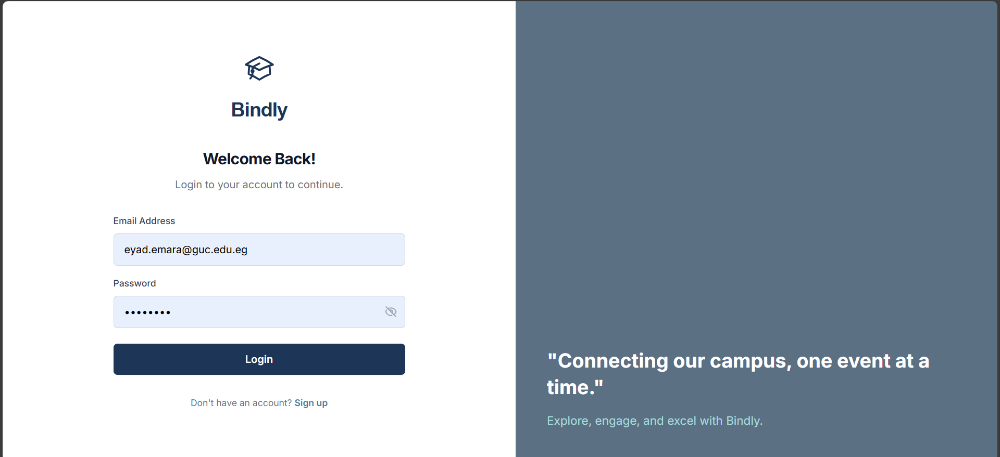
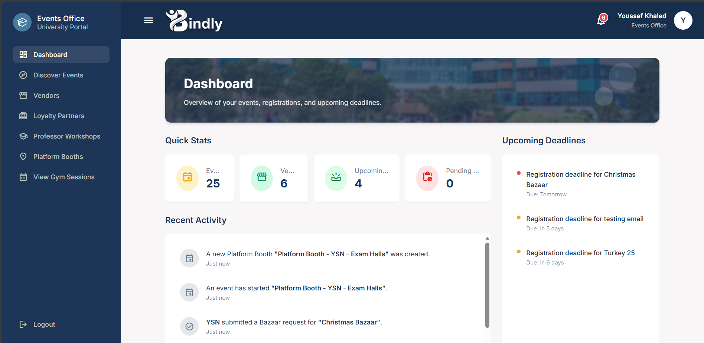
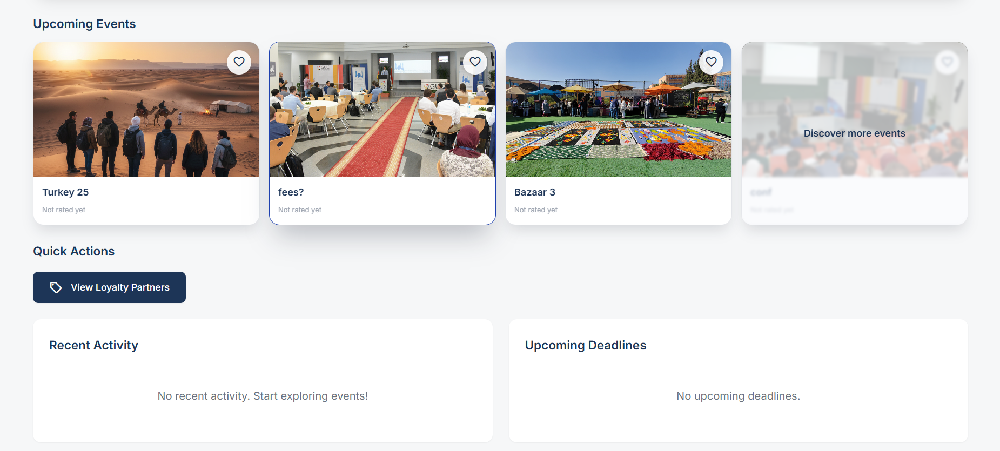
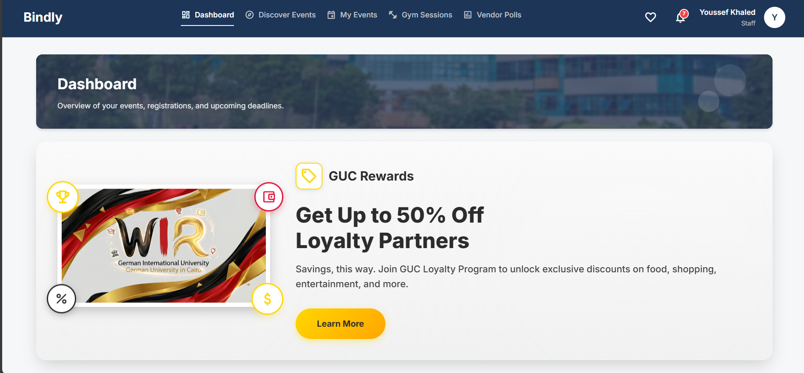
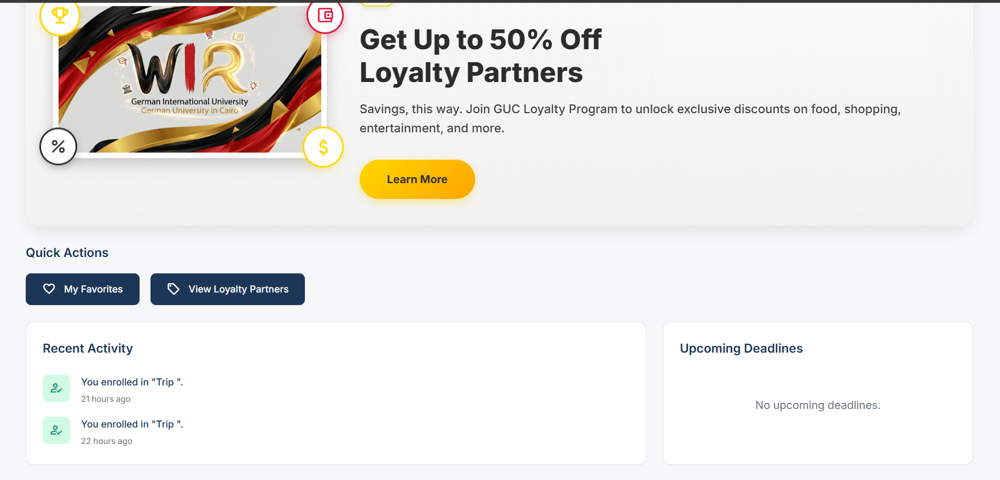
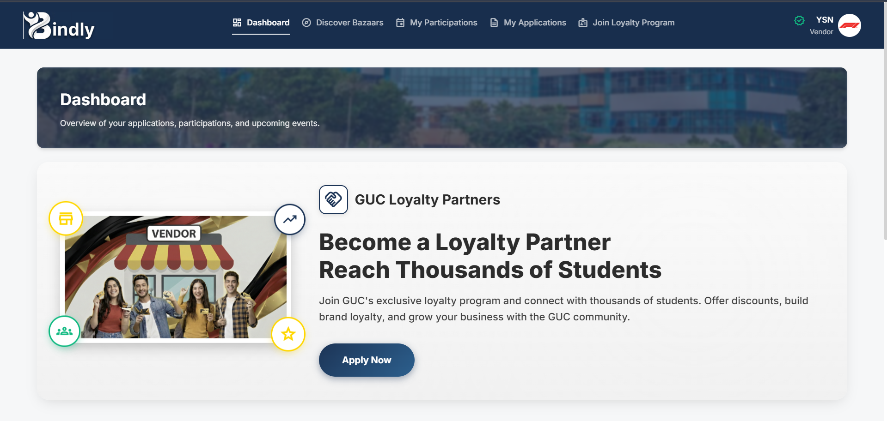
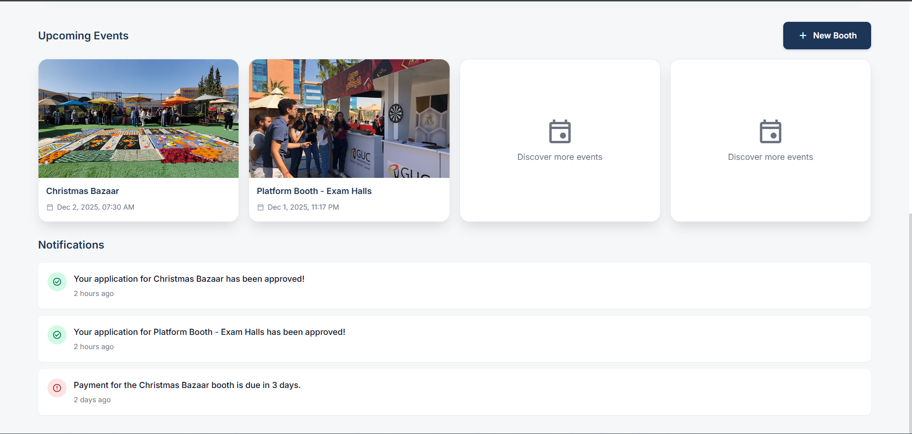
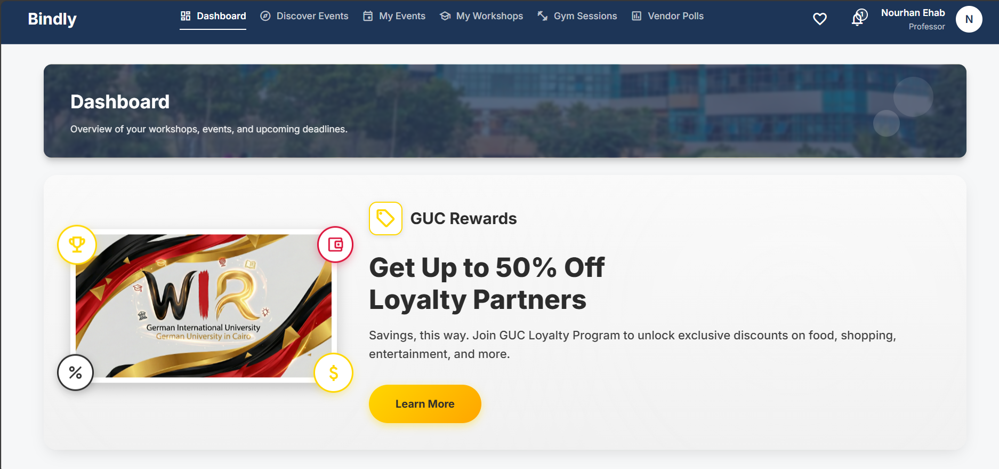
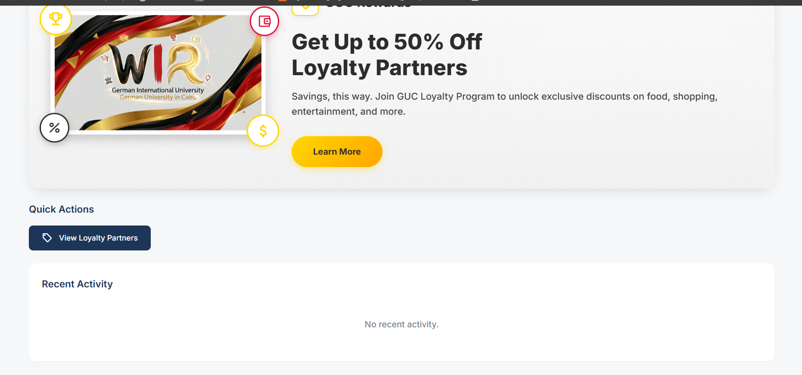

# Bindly  
*A unified, role-aware, capacity-safe, university-specific event management platform for students, professors, staff, vendors, and administrators.*

Bindly is a comprehensive campus web application built to centralize university event operations and campus stakeholder workflows into one smart system.  
Its main purpose is to handle **event creation, approval transparency, capacity-safe registration, document-verified vendor onboarding, real-time notifications, and campus bookings (courts & gym sessions)** — reducing operational chaos and human errors while improving collaboration and efficiency across the university.


## 🚀 Motivation

We built **Bindly** to remove the fragmentation and operational chaos that happens when campus event workflows are managed across different groups and tools.  
It solves the lack of coordination between:

- **Students**
- **Professors**
- **Teaching Assistants**
- **University Staff**
- **Vendors**
- **Administrators**
- **Event Office**

Bindly introduces:

- A **structured approval and edit–request workflow**
- **Capacity-safe event registration**
- **Role-based event access and restrictions**
- **Centralized communication and transparency**
- **Vendor onboarding with verified documents**
- **Real-time notifications and centralized dashboards**

This platform is important because it:

> ✅ saves time  
> ✅ reduces human errors  
> ✅ ensures transparency  
> ✅ improves collaboration  
> ✅ organizes data reliably  
> ✅ and makes campus operations smoother and more dependable.

## 🚧 Build Status

The **Bindly platform** is fully developed, operational, and stable with all **core and optional modules implemented successfully**.  
The system has undergone **end-to-end workflow testing, including event approvals, capacity-safe registration, vendor onboarding, payment webhooks, and notification delivery**, and is now ready for **deployment or future enhancements**.

### ⚠️ Known Issues & Limitations

The following issues have been identified and are planned for future improvements:

1. **High CPU consumption** — The scheduler for notifications and workshop completion emails can consume significant CPU resources when processing large batches of reminders or completion emails.

2. **Slow dashboard rendering** — Some pages, especially dashboards, take a long time to render due to multiple API calls and data processing. This is particularly noticeable when loading dashboards with many events or registrations.

3. **N+1 query problem in court availability** — In `getAllCourts`, when a date is provided, the code loops through each court and queries bookings individually, causing multiple database queries instead of a single optimized query. This can lead to performance degradation with many courts.

4. **No API rate limiting** — The application lacks rate limiting middleware, which could allow API abuse, DDoS attacks, or excessive resource consumption from repeated requests. This is a security and performance concern for production deployment.

5. **File upload storage accumulation** — Uploaded files (vendor documents, profile pictures, event banners) are stored locally in the uploads directory without automatic cleanup. Over time, this can consume significant disk space, especially with vendor document uploads and event images.

### ✅ Current State
- Core functionality is stable and production-ready  
- All major features are implemented and tested  
- Future updates will focus on:
  - Performance optimizations (addressing the issues above)  
  - Scalability improvements  
  - System maintenance  
  - Minor UX and interface refinements  
  - Campus-specific feature extensions  

> ❗ **Note:** Any references to upcoming issues or feature requests can be tracked via GitHub Issues or Pull Requests.

## 💻 Code Style

This project follows consistent coding conventions and naming patterns:

### Naming Conventions

- **Files & Components**: 
  - React components use PascalCase (e.g., `StudentDashboard.jsx`, `AuthContext.jsx`)
  - Backend controllers use camelCase with descriptive names (e.g., `authController.js`, `eventController.js`)
  - Utility files use camelCase (e.g., `sendReceiptEmail.js`, `calculateVendorFee.js`)

- **Variables & Functions**:
  - camelCase for variables and functions (e.g., `loadDashboardData`, `handleRegisterClick`)
  - Constants use UPPER_SNAKE_CASE (e.g., `JWT_SECRET`, `MONGO_URI`)
  - Boolean variables often use `is`, `has`, `should` prefixes (e.g., `isRegistered`, `hasTaxCard`)

- **Database Models**:
  - Model files use PascalCase (e.g., `UserModel.js`, `EventModel.js`)
  - Schema fields use camelCase (e.g., `startDate`, `registeredCount`)

- **API Routes**:
  - RESTful conventions with kebab-case in URLs (e.g., `/api/vendor-requests`, `/api/gym-sessions`)
  - Route handlers use descriptive verbs (e.g., `registerForEvent`, `createVendorRequest`)

### Code Formatting

- **Indentation**: 2 spaces (consistent across frontend and backend)
- **Quotes**: Single quotes for JavaScript/JSX strings
- **Semicolons**: Used consistently
- **Line Length**: Aim for 100-120 characters max per line
- **Comments**: Used for complex logic, API endpoints, and important business rules

### React Component Structure

```javascript
// Standard component structure:
import React, { useState, useEffect } from 'react';
// ... other imports

const ComponentName = () => {
  // 1. State declarations
  // 2. Hooks (useEffect, useCallback, etc.)
  // 3. Handler functions
  // 4. Render logic
  return (/* JSX */);
};

export default ComponentName;
```

### Backend Controller Structure

```javascript
// Standard controller structure:
const Model = require('../models/modelName');

exports.functionName = async (req, res) => {
  try {
    // Validation
    // Business logic
    // Database operations
    // Response
  } catch (error) {
    // Error handling
  }
};
```

## 🛠 Tech Stack

### Backend
- **Runtime & Framework**
  - **Node.js** (Express.js)
  - **MongoDB** with **Mongoose** ODM
- **Auth & Security**
  - **JWT** for authentication
  - **bcryptjs** for password hashing
- **Validation & APIs**
  - **express-validator** for request validation
  - **cors** for cross-origin resource sharing
- **Payments & Emails**
  - **Stripe** for payment processing
  - **Nodemailer** for email services
- **Files, Docs & QR**
  - **Multer** for file uploads
  - **PDFKit** for PDF generation
  - **qrcode** for QR code generation
- **Scheduling & Utilities**
  - **node-cron** for scheduled jobs (e.g., notifications)
  - **xlsx** for Excel import/export
- **Tooling**
  - **ESLint** (with **@eslint/js**, **globals**) for linting
  - **nodemon** / **supervisor** for auto-restart in development
  - **concurrently** for running backend & frontend together

### Frontend
- **Core**
  - **React** + **React DOM**
  - **React Router** for SPA routing
- **Data & Realtime**
  - **Axios** for HTTP/API calls
  - **socket.io-client** for real-time features
- **Build & Dev Tools**
  - **create-react-app** tooling via **react-scripts**
  - **http-proxy-middleware** for local API proxying
  - **web-vitals** for basic performance metrics
- **Testing**
  - **@testing-library/react**
  - **@testing-library/jest-dom**
  - **@testing-library/user-event**

## 📸 Screenshots

### 1. Login Page


### 2. signup page


### 3. eventoffice dashboard


### 5. TA dashboard1


### 6. TA dashboard (continue)



### 7. staff dashboard



### 8. staff dashboard (continue)



### 9. vendor dashboard



### 10. vendor dashboard (continue)



### 11. proffessor dashboard



### 12. proffessor dashboard



## ✨ Features

### Event Management
- **Multiple Event Types**: Bazaars, Trips, Workshops, Conferences, Booth Setups, Sports Fields, and Gym/Fitness sessions
- **Event Registration**: Students, professors, and staff can register with capacity limits
- **Event Approval Workflow**: Admin and Events Office approval system with edit requests
- **Event Restrictions**: Support for restricted events with stakeholder/type-based access
- **Event Archiving**: Archive past events for historical reference
- **Event Editing**: Update event details even after publishing if needed
- **Automated Reminders**: Users get reminders 1 day and 1 hour before registered events
- **Commenting System**: Users can leave feedback/comments on events
- **Role Management**: Admin can assign roles to staff/TA/professor accounts
- **Vendor Validation**: Vendors can be verified using uploaded tax card + company logo
- **Booth Requests**: Vendors can apply to join bazaars or request campus booth setups
- **QR Distribution**: Approved vendors receive QR codes for registered visitors
- **Fee System**: Accepted vendors pay participation fees and receive receipts
- **Loyalty Program Support**: Vendors can apply to join or cancel from GUC loyalty partnerships
- **Moderation Tools**: Admins can block users or delete inappropriate comments

---

## 💡 Code Examples

Here are key code snippets demonstrating core functionality:

### 1. User Signup Function (Backend)

```javascript
// backend/controllers/authController.js
const signup = async (req, res) => {
  try {
    const { email, password, firstName, lastName, userType, gucId, companyName } = req.body;
    
    // Normalize email
    const normalizedEmail = String(email).toLowerCase().trim();
    
    // Check for existing user
    const existingUser = await User.findOne({ email: normalizedEmail });
    if (existingUser) {
      return res.status(409).json({ 
        success: false, 
        message: 'User with this email already exists' 
      });
    }
    
    // GUC email validation for academic users
    if (['Student', 'Staff', 'TA', 'Professor'].includes(userType)) {
      const gucEmailRegex = /^[a-z0-9._%+-]+@student\.guc\.edu\.eg$|^[a-z0-9._%+-]+@guc\.edu\.eg$/;
      if (!gucEmailRegex.test(normalizedEmail)) {
        return res.status(400).json({
          success: false,
          message: 'GUC users must use a valid GUC email address'
        });
      }
    }
    
    // Create user with appropriate defaults
    const userData = {
      email: normalizedEmail,
      password,
      isVerified: false
    };
    
    if (userType === 'Student' || userType === 'Vendor') {
      userData.userType = userType;
    }
    
    const user = await User.create(userData);
    // ... send verification email
    
    res.status(201).json({
      success: true,
      message: 'User created. Verification email sent.',
      user: { id: user._id, email: user.email, userType: user.userType }
    });
  } catch (error) {
    res.status(500).json({ success: false, message: error.message });
  }
};
```

### 2. Event Registration with Capacity Check (Backend)

```javascript
// backend/controllers/eventController.js
exports.registerForEvent = async (req, res) => {
  try {
    const id = req.params.id;
    const userId = req.user?._id || req.user?.id;
    
    // Find event or trip
    let holder = await Event.findById(id);
    let holderType = holder ? "event" : null;
    
    if (!holder) {
      holder = await Trip.findById(id);
      holderType = holder ? "trip" : null;
    }
    
    if (!holder) {
      return res.status(404).json({ msg: "Event/Trip not found" });
    }
    
    // Capacity check
    const regCount = await Registration.countDocuments({ event: id });
    if (holder.capacity && regCount >= holder.capacity) {
      return res.status(400).json({ 
        msg: `${holderType === 'trip' ? 'Trip' : 'Event'} is full` 
      });
    }
    
    // Prevent duplicate registration
    const existing = await Registration.findOne({ event: id, user: userId });
    if (existing) {
      return res.status(400).json({ msg: "You are already registered" });
    }
    
    // Create registration
    const registration = await Registration.create({
      event: id,
      user: userId,
      role: req.user.userType.toLowerCase(),
      status: "approved",
      paid: (holder.price || 0) <= 0
    });
    
    res.status(201).json({
      success: true,
      message: "Registration successful",
      registration
    });
  } catch (error) {
    res.status(500).json({ success: false, message: error.message });
  }
};
```

### 3. Authentication Context (Frontend)

```javascript
// frontend/src/contexts/AuthContext.jsx
export const AuthProvider = ({ children }) => {
  const [user, setUser] = useState(null);
  const [loading, setLoading] = useState(true);
  const socketRef = useRef(null);

  useEffect(() => {
    // Check if user is logged in on app start
    const token = localStorage.getItem('token');
    if (token) {
      axios.defaults.headers.common['Authorization'] = `Bearer ${token}`;
      
      const userData = localStorage.getItem('user');
      if (userData) {
        const parsed = JSON.parse(userData);
        setUser(parsed);
        
        // Initialize socket connection for real-time notifications
        if (!socketRef.current) {
          const socket = ioClient('http://localhost:5000', {
            auth: { token },
            transports: ['websocket']
          });
          socketRef.current = socket;
          
          socket.on('connect', () => {
            if (parsed && parsed._id) socket.emit('join', parsed._id);
          });
          
          socket.on('new_notification', (notif) => {
            window.dispatchEvent(new CustomEvent('new_notification', { detail: notif }));
          });
        }
      }
    }
    setLoading(false);
  }, []);

  const login = async (email, password) => {
    try {
      const response = await axios.post('http://localhost:5000/api/auth/login', {
        email,
        password
      });
      
      if (response.data.success) {
        const { token, user } = response.data;
        localStorage.setItem('token', token);
        localStorage.setItem('user', JSON.stringify(user));
        setUser(user);
        return { success: true };
      }
    } catch (error) {
      return { success: false, message: error.response?.data?.message || 'Login failed' };
    }
  };
  
  // ... logout, signup functions
  
  return (
    <AuthContext.Provider value={{ user, login, logout, signup, loading }}>
      {children}
    </AuthContext.Provider>
  );
};
```

### 4. Event Reminder Notification Service (Backend)

```javascript
// backend/services/notificationService.js
async function processEventReminders(events, timeframe) {
  for (const event of events) {
    try {
      // Get student registrations (for workshops/trips)
      const studentRegistrations = await StudentRegistration.find({
        event: event._id,
        status: { $ne: 'cancelled' }
      });
      
      // Get regular registrations (for Staff, TA, Professor, etc.)
      const regularRegistrations = await Registration.find({
        event: event._id,
        status: { $in: ['approved', 'pending'] }
      });
      
      // Process regular registrations
      for (const registration of regularRegistrations) {
        const userId = registration.user;
        if (!userId) continue;
        
        const existingNotification = await Notification.findOne({
          type: 'event_reminder',
          recipient: userId,
          'metadata.timeframe': timeframe,
          'metadata.eventId': event._id.toString()
        });
        
        if (!existingNotification) {
          await Notification.create({
            recipient: userId,
            type: 'event_reminder',
            title: `Reminder: ${event.title} starts in ${timeframe}`,
            message: `The event "${event.title}" will start in ${timeframe} at ${event.location}`,
            relatedEvent: event._id,
            priority: timeframe === '1 hour' ? 'high' : 'medium',
            metadata: {
              eventTitle: event.title,
              eventDate: event.startDate,
              location: event.location,
              timeframe: timeframe,
              eventId: event._id.toString()
            }
          });
        }
      }
    } catch (error) {
      console.error(`Error processing event ${event._id}:`, error);
    }
  }
}
```

### 5. Dashboard Data Loading with Error Handling (Frontend)

```javascript
// frontend/src/components/StudentDashboard.jsx
const loadDashboardData = async () => {
  try {
    setLoading(true);
    
    // Fetch events from discover events
    const eventsResult = await eventsApiService.getStudentEvents({});
    
    if (eventsResult.success) {
      let eventsList = [];
      if (Array.isArray(eventsResult.data)) {
        eventsList = eventsResult.data;
      } else if (eventsResult.data?.events) {
        eventsList = eventsResult.data.events;
      }
      
      const now = new Date();
      const upcoming = eventsList.filter(ev => {
        if (!ev.startDate) return false;
        const date = new Date(ev.startDate);
        return !isNaN(date.getTime()) && date > now;
      }).sort((a, b) => {
        const dateA = new Date(a.startDate || 0);
        const dateB = new Date(b.startDate || 0);
        return dateA - dateB;
      });
      
      // Generate upcoming deadlines from upcoming events
      const deadlines = upcoming
        .map(reg => {
          const eventDate = reg.eventDate || reg.event?.startDate;
          if (!eventDate) return null;
          const date = new Date(eventDate);
          if (isNaN(date.getTime())) return null;
          
          const timeDiff = date.getTime() - now.getTime();
          const isUrgent = timeDiff < 7 * 24 * 60 * 60 * 1000;
          
          return {
            id: reg.id || reg._id,
            month: date.toLocaleDateString('en-US', { month: 'short' }).toUpperCase(),
            day: date.getDate(),
            title: reg.eventTitle || reg.event?.title || 'Event',
            description: 'Event date',
            color: isUrgent 
              ? 'bg-red-100 dark:bg-red-900/50 text-red-600 dark:text-red-300'
              : 'bg-blue-100 dark:bg-blue-900/50 text-blue-600 dark:text-blue-300'
          };
        })
        .filter(d => d !== null)
        .sort((a, b) => {
          const year = new Date().getFullYear();
          const dateA = new Date(`${a.month} ${a.day}, ${year}`);
          const dateB = new Date(`${b.month} ${b.day}, ${year}`);
          return dateA - dateB;
        })
        .slice(0, 3);
      
      setUpcomingDeadlines(deadlines);
    }
  } catch (error) {
    console.error('Error loading dashboard data:', error);
    setError('Failed to load dashboard data');
  } finally {
    setLoading(false);
  }
};
```

### 6. Vendor Request Creation with File Upload (Backend)

```javascript
// backend/controllers/vendorRequestController.js
const createVendorRequest = async (req, res) => {
  try {
    const {
      eventType,
      attendees: rawAttendees,
      boothSize,
      durationWeeks,
      boothLocation
    } = req.body;

    // Parse attendees if sent as JSON string (multipart/form-data)
    let attendees = rawAttendees;
    if (typeof attendees === 'string') {
      try {
        attendees = JSON.parse(attendees);
      } catch (e) {
        attendees = [];
      }
    }

    // Validate required fields
    if (!eventType || !attendees || !Array.isArray(attendees) || attendees.length === 0) {
      return res.status(400).json({
        message: 'Event type and at least one attendee are required',
        error: 'Missing required fields'
      });
    }

    // Validate attendees structure
    for (let i = 0; i < attendees.length; i++) {
      const attendee = attendees[i];
      if (!attendee.name || !attendee.email) {
        return res.status(400).json({
          message: `Attendee at index ${i} must have a valid name and email`,
          error: 'Invalid attendee structure'
        });
      }
      attendees[i] = {
        name: attendee.name.trim(),
        email: attendee.email.trim()
      };
    }

    // Prepare request data
    const requestData = {
      vendor: req.user._id,
      eventType,
      attendees,
      status: 'pending'
    };

    // Add optional fields if valid
    if (boothSize && ['2x2', '4x4'].includes(boothSize)) {
      requestData.boothSize = boothSize;
    }

    if (durationWeeks) {
      const duration = parseInt(durationWeeks);
      if (!isNaN(duration) && duration >= 1 && duration <= 4) {
        requestData.durationWeeks = duration;
      }
    }

    // If files were uploaded (multipart), include their stored paths
    if (req.files && Array.isArray(req.files) && req.files.length > 0) {
      requestData.individualIdsPaths = req.files.map(f => '/uploads/' + f.filename);
    }

    // Create the vendor request
    const vendorRequest = new VendorRequest(requestData);
    await vendorRequest.save();

    res.status(201).json({
      message: 'Vendor request created successfully',
      request: vendorRequest
    });
  } catch (error) {
    console.error('Error creating vendor request:', error);
    res.status(500).json({
      message: 'Server error',
      error: error.message
    });
  }
};
```

---

## 👥 Stakeholders & Permissions

### 🎓 Student
- Sign up using GUC email (First name, Last name, password, phone…)
- Verify email with received activation link
- Log in to dashboard
- Browse all university events
- Register to events (if capacity available)
- Cannot register if event is full
- Book sports fields (football/tennis/basketball) at available time slots
- Register to gym/fitness sessions (yoga, pilates, zumba…)
- Receive reminders before attending
- Receive notifications if an event/session is edited or cancelled
- Leave comments/feedback on events
- Participate in campus polls (e.g., vendors to invite, services to request…)

---

### 🧑‍💼 Staff & TA
- Sign up using GUC email
- Admin assigns internal role
- Log in and view dashboard
- Browse all university events
- Register just like students
- Book sports fields and gym sessions
- Leave feedback/comments
- Receive all notifications/reminders for what they register to

---

### 👨‍🏫 Professor
- All student capabilities +
- Create workshops by filling:
  - Workshop name
  - Location (Campus Room)
  - Date & Time
  - Short Description
  - Capacity limit
  - Source of funding (External or GUC)
  - Extra required resources
  - Registration deadline
- Edit workshop details after creation
- View list of workshops they created
- View number of registered attendees + remaining spots
- Receive notifications if accepted, rejected, or asked to edit

---

### 🏢 Events Office
- Create official events:
  - **Bazaars** → name, start/end time, location, description, registration deadline
  - **Trips** → name, transportation, location, date/time, capacity, description, deadline
  - **Conferences** → name, funding source, date/time, location, resources, description
- Edit any event details after creation
- Receive alerts when professors submit workshop requests
- Accept/publish professor workshops
- Reject workshops or request edits
- Review vendor requests to join bazaars and booths
- Approve/reject vendor participation
- System notifies vendors automatically

---

### 🛡 Admin
- Assign correct roles to staff/TA/professor after they sign up
- Create or delete Events Office/Admin accounts
- Block any user if needed
- View list of all users + status (active or blocked)
- Delete inappropriate comments
- Moderate platform behavior and user activity

---

### 🧾 Vendor
- Sign up using company email + password + company name
- Upload tax card and company logo to prove validity
- Verify email link via system email
- Admin/Events Office reviews and approves files
- Once approved vendor can log in
- View list of upcoming bazaars
- Apply to join a bazaar from available list
- Apply for campus booth setups by filling:
  - Company name
  - Products/Category
  - IDs of attending individuals
  - Booth size
  - Duration and location
  - Setup dates/times
- Upload attendee IDs for full participation period
- Receive email when bazaar/booth request is accepted/rejected
- If accepted → vendor must pay participation fees
- Receive payment receipt via email
- Receive visitor QR codes via email
- Cancel participation request anytime before payment
- Apply or cancel from **GUC Loyalty Program**:
  - Form includes discount rate, promo code, terms & conditions

---

## 🔁 System Flows

### ✅ 1. User Sign-Up & Verification (Students / Staff / TA / Professors / Vendors)
1. User enters university/company registration info + email & password
2. System enforces GUC email for university stakeholders
3. Vendor uploads business proof files
4. System sends verification link email
5. User clicks verification link → account activated
6. Admin assigns role if internal university user
7. Vendor account is validated by Admin or Events Office before full activation

---

### ✅ 2. Event Creation Flow (Admin / Events Office / Professor Workshops)
1. Creator opens “Create Event” form
2. Selects event type
3. Inputs all details (time, location, description, capacity, resources, funding, deadline…)
4. Submits event for review if professor workshop
5. System publishes immediately if Admin/Events Office
6. If workshop:
   - Events Office can accept → publish, reject, request edits
7. Creator receives status notifications

---

### ✅ 3. Registration Flow (Student / Staff / TA / Professor)
1. User opens Events page
2. Filters by type
3. Reads event details
4. Clicks register
5. System checks capacity
6. If full → block registration
7. If success → add to “My Events”
8. System sends confirmation and later reminders

---

### ✅ 4. Vendor Participation Request Flow
1. Vendor views bazaar list
2. Selects bazaar
3. Fills participation/booth form
4. System marks as “Pending” and notifies Events Office
5. Events Office/Admin reviews:
   - Approve → vendor pays fees → gets receipt + visitor QR codes
   - Reject → vendor notified and remains not included
6. Vendor can cancel request anytime before payment

---

### ✅ 5. Sports & Gym Booking Flow
1. Student opens facility page (Sports/Gym)
2. System shows free slots/sessions
3. Student selects and confirms
4. Booking saved to dashboard
5. User receives notification if cancelled or edited

---

### ✅ 6. Comment Moderation Flow
1. Users post feedback on events
2. Admin views comments
3. If inappropriate → Admin deletes comment
4. If user continues abuse → Admin blocks user


## 📁 Project Structure

Below is the full project layout (excluding `node_modules`). Generated folders such as uploads and build assets are included but grouped where appropriate.

```text
Bindly-/
├── (_CSEN704_) 1 - Project Requirements (Project).xlsx
├── BLOCK_USER_FEATURE.md
├── BLOCK_USER_POSTMAN_TESTS.md
├── create-admin.js
├── DETAILED_CHANGES.md
├── IMPLEMENTATION_CHECKLIST.md
├── package.json
├── package-lock.json
├── PAYMENT_RECEIPT_EMAIL_ARCHITECTURE.md
├── PAYMENT_RECEIPT_EMAIL_COMPLETE.md
├── PAYMENT_RECEIPT_EMAIL_IMPLEMENTATION.md
├── PAYMENT_RECEIPT_EMAIL_TEST_GUIDE.md
├── POSTMAN_EVENT_PAYMENT_TEST.md
├── POSTMAN_FINAL_TESTING_GUIDE.md
├── POSTMAN_LIVE_TEST_STEPS.md
├── POSTMAN_TEST_STEPS.md
├── postman-admin-features-tests.json
├── README.md
├── STRIPE_COMPLETE.md
├── STRIPE_PAYMENT_SUMMARY.md
├── STRIPE_QUICK_START.md
├── TEST_STRIPE_PAYMENT.md
├── test-professor-events.js
├── VERIFICATION_FLOW_IMPLEMENTATION.md
├── verify-stripe.ps1
├── verify-stripe.sh
├── backend/
│   ├── AUTH_API_DOCUMENTATION.md
│   ├── check-events.js
│   ├── check-payments.js
│   ├── check-registrations.js
│   ├── check-users.js
│   ├── create-sample-booths.js
│   ├── create-sample-vendor-requests.js
│   ├── EMAIL_SETUP_GUIDE.md
│   ├── ENV_SETUP.md
│   ├── eslint.config.mjs
│   ├── package.json
│   ├── package-lock.json
│   ├── POSTMAN_TESTING_GUIDE.md
│   ├── server.js
│   ├── standalone-booth-events-final.json
│   ├── standalone-booth-events.json
│   ├── standalone-booths-data.json
│   ├── standalone-booths.json
│   ├── STRIPE_PAYMENT_SETUP.md
│   ├── test-admin-features.js
│   ├── test-archived-events.js
│   ├── test-booth-poll.js
│   ├── test-complete-flow.js
│   ├── test-email-webhook.js
│   ├── test-gym-sessions.js
│   ├── test-image.png
│   ├── test-restrictions.js
│   ├── test-webhook-sim.js
│   ├── vendor-requests.json
│   ├── controllers/
│   │   ├── adminAccountsController.js
│   │   ├── adminController.js
│   │   ├── announcementController.js
│   │   ├── authController.js
│   │   ├── authVerifyController.js
│   │   ├── bazaarController.js
│   │   ├── boothController.js
│   │   ├── courtController.js
│   │   ├── dashboardController.js
│   │   ├── devEmailController.js
│   │   ├── eventController.js
│   │   ├── gymController.js
│   │   ├── gymSessionController.js
│   │   ├── notificationController.js
│   │   ├── paymentVerificationController.js
│   │   ├── professorController.js
│   │   ├── stripeSuccessController.js
│   │   ├── stripeWebhookController.js
│   │   ├── studentRegistrationController.js
│   │   ├── tripController.js
│   │   ├── vendorController.js
│   │   ├── vendorDocumentController.js
│   │   ├── vendorRequestController.js
│   │   ├── workshopCompletionController.js
│   │   └── workshopController.js
│   ├── middleware/
│   │   ├── authMiddleware.js
│   │   └── uploadMiddleware.js
│   ├── models/
│   │   ├── AdminModel.js
│   │   ├── announcementModel.js
│   │   ├── bazaarModel.js
│   │   ├── boothModel.js
│   │   ├── boothPollModel.js
│   │   ├── courtBookingModel.js
│   │   ├── courtModel.js
│   │   ├── EmailModel.js
│   │   ├── eventModel.js
│   │   ├── gymRegistrationModel.js
│   │   ├── GymSession.js
│   │   ├── gymSessionModel.js
│   │   ├── notificationModel.js
│   │   ├── paymentModel.js
│   │   ├── Professor.js
│   │   ├── registrationModel.js
│   │   ├── studentRegistrationModel.js
│   │   ├── tripModel.js
│   │   ├── userModel.js
│   │   ├── vendorLoyaltyProgramModel.js
│   │   ├── vendorRequest.js
│   │   ├── vendorVoteModel.js
│   │   └── Workshop.js
│   ├── routes/
│   │   ├── adminRoutes.js
│   │   ├── announcementRoutes.js
│   │   ├── authRoutes.js
│   │   ├── bazaarRoutes.js
│   │   ├── boothRoutes.js
│   │   ├── courtRoutes.js
│   │   ├── dashboardRoutes.js
│   │   ├── devEmailRoutes.js
│   │   ├── devEmailTestRoutes.js
│   │   ├── eventRoutes.js
│   │   ├── gymRoutes.js
│   │   ├── gymSessionRoutes.js
│   │   ├── notificationRoutes.js
│   │   ├── professorRoutes.js
│   │   ├── studentRegistrationRoutes.js
│   │   ├── tripRoutes.js
│   │   ├── vendorRequestRoutes.js
│   │   ├── vendorRoutes.js
│   │   └── workshopRoutes.js
│   ├── scripts/
│   │   ├── check-and-delete-email.js
│   │   ├── create-test-events.js
│   │   ├── create-test-users.js
│   │   ├── insert-dev-email.js
│   │   ├── migrateEventRatings.js
│   │   ├── README.md
│   │   ├── seedCourts.js
│   │   ├── setup-test-uploads.js
│   │   ├── TEST_EVENTS_README.md
│   │   ├── test-sales-report.js
│   │   ├── test-vendor-loyalty-program.js
│   │   ├── trigger-send-qrcodes.js
│   │   └── updateWorkshopPrices.js
│   ├── services/
│   │   ├── notificationScheduler.js
│   │   ├── notificationService.js
│   │   └── socket.js
│   ├── utils/
│   │   ├── calculateVendorFee.js
│   │   ├── cleanupUserRegistrations.js
│   │   ├── generateCertificate.js
│   │   ├── generateQRCode.js
│   │   ├── mailer.js
│   │   ├── sendCommentWarningEmail.js
│   │   ├── sendGymCancellationEmail.js
│   │   ├── sendGymEditEmail.js
│   │   ├── sendQRCodesToVendor.js
│   │   ├── sendReceiptEmail.js
│   │   ├── sendRefundEmail.js
│   │   ├── sendVendorRequestStatusEmail.js
│   │   └── sendWorkshopCompletionEmail.js
│   ├── test-uploads/
│   │   └── vendors/
│   │       ├── abc/
│   │       │   └── logo.png
│   │       ├── athlete-hub/
│   │       │   ├── individual-ids.pdf
│   │       │   ├── logo.png
│   │       │   └── tax-card.pdf
│   │       ├── booknook-publishers/
│   │       │   ├── individual-ids.pdf
│   │       │   ├── logo.png
│   │       │   └── tax-card.pdf
│   │       ├── campus-coffee-roasters/
│   │       │   ├── individual-ids.pdf
│   │       │   ├── logo.png
│   │       │   └── tax-card.pdf
│   │       ├── mindful-meals/
│   │       │   ├── individual-ids.pdf
│   │       │   ├── logo.png
│   │       │   └── tax-card.pdf
│   │       ├── ro/
│   │       │   └── logo.png
│   │       ├── syn/
│   │       │   ├── individual-ids.pdf
│   │       │   ├── logo.png
│   │       │   └── tax-card.pdf
│   │       ├── tech-solutions-inc/
│   │       │   ├── individual-ids.pdf
│   │       │   ├── logo.png
│   │       │   └── tax-card.pdf
│   │       ├── testco/
│   │       │   └── tax-card.pdf
│   │       └── vendorv/
│   │           ├── logo.png
│   │           └── tax-card.pdf
│   └── uploads/
│       └── ... (runtime uploaded images and PDFs)
├── frontend/
│   ├── devServer.js
│   ├── package.json
│   ├── package-lock.json
│   ├── webpackDevServer.config.js
│   ├── build/
│   │   ├── assets/
│   │   │   └── images/
│   │   │       └── ... (optimized build images)
│   │   └── manifest.json
│   ├── public/
│   │   ├── index.html
│   │   ├── manifest.json
│   │   └── assets/
│   │       └── images/
│   │           ├── ad.png
│   │           ├── admin-users.jpg
│   │           ├── basketball.webp
│   │           ├── bazaar-background.jpg
│   │           ├── booth-background.jpg
│   │           ├── campus-courts.png
│   │           ├── conference-background.jpg
│   │           ├── dashboardimage.jpg
│   │           ├── events-banner.jpeg
│   │           ├── football.jpg
│   │           ├── gym.jpg
│   │           ├── login-background.jpg
│   │           ├── LoyaltyProgram.png
│   │           ├── map.jpg
│   │           ├── platform-booth.jpg
│   │           ├── README.md
│   │           ├── tennis.jpg
│   │           ├── trip-background.png
│   │           ├── VendorAD.png
│   │           ├── workshop-background.jpg
│   │           └── workshop.jpg
│   └── src/
│       ├── App.jsx
│       ├── index.js
│       ├── routes.js
│       ├── setupProxy.js
│       ├── api/
│       │   ├── adminApi.js
│       │   ├── bazaarApi.js
│       │   ├── courtsApi.js
│       │   ├── eventManagementApi.js
│       │   ├── eventsApi.js
│       │   ├── gymApi.js
│       │   ├── gymSessionApi.js
│       │   ├── notificationApi.js
│       │   ├── professorApi.js
│       │   ├── studentRegistrationApi.js
│       │   ├── vendorApi.js
│       │   └── vendorRequestApi.js
│       ├── components/
│       │   ├── BazaarForm.jsx
│       │   ├── BoothApplicationForm.jsx
│       │   ├── BoothList.jsx
│       │   ├── CampusMapSelector.jsx
│       │   ├── ConferenceForm.jsx
│       │   ├── FileChooser.jsx
│       │   ├── GymSessionForm.jsx
│       │   ├── GymSessionRegistrationForm.jsx
│       │   ├── IDUploadModal.jsx
│       │   ├── Navbar.jsx
│       │   ├── PlatformBoothMapSelector.jsx
│       │   ├── PlatformBoothsModal.jsx
│       │   ├── PlatformMapSelector.jsx
│       │   ├── ProfessorDashboard.jsx
│       │   ├── StaffDashboard.jsx
│       │   ├── StandaloneBoothsBrowser.jsx
│       │   ├── StudentDashboard.jsx
│       │   ├── StudentRegistrationForm.jsx
│       │   ├── TADashboard.jsx
│       │   ├── TripForm.jsx
│       │   ├── VendorDocumentsModal.jsx
│       │   ├── VendorNotificationBell.jsx
│       │   └── WorkshopEditRequestModal.jsx
│       ├── contexts/
│       │   └── AuthContext.jsx
│       ├── pages/
│       │   ├── AdminDashboard.jsx
│       │   ├── AdminEventsView.jsx
│       │   ├── AdminLogin.jsx
│       │   ├── AdminLoyaltyProgramVendors.jsx
│       │   ├── AdminPlatformBoothRequests.jsx
│       │   ├── AdminProfile.jsx
│       │   ├── AdminUsers.jsx
│       │   ├── AdminVendors.jsx
│       │   ├── BoothPolls.jsx
│       │   ├── Confrences.jsx
│       │   ├── CourtAvailability.jsx
│       │   ├── CreateBooth.jsx
│       │   ├── CreateWorkshop.jsx
│       │   ├── Dashboard.jsx
│       │   ├── EditBazaar.jsx
│       │   ├── EditConfrences.jsx
│       │   ├── EditTrip.jsx
│       │   ├── EventPayment.jsx
│       │   ├── Events.jsx
│       │   ├── EventsList.jsx
│       │   ├── EventsOfficeCreatePoll.jsx
│       │   ├── EventsOfficeDashboard.jsx
│       │   ├── EventsOfficeEventsView.jsx
│       │   ├── EventsOfficeLoyaltyProgramVendors.jsx
│       │   ├── EventsOfficeNotificationBell.jsx
│       │   ├── EventsOfficeVendors.jsx
│       │   ├── EventsOfficeWorkshops.jsx
│       │   ├── GymManage.jsx
│       │   ├── GymSchedule.jsx
│       │   ├── Login.jsx
│       │   ├── MyWallet.jsx
│       │   ├── MyWorkshops.jsx
│       │   ├── PaymentCancel.jsx
│       │   ├── PaymentSuccess.jsx
│       │   ├── PendingVerification.jsx
│       │   ├── PlatformBoothRequests.jsx
│       │   ├── PlatformBoothReservation.jsx
│       │   ├── PlatformBooths.jsx
│       │   ├── ProfessorEventsView.jsx
│       │   ├── ProfessorFavorites.jsx
│       │   ├── ProfessorLoyaltyVendorsView.jsx
│       │   ├── ProfessorMyRegistrations.jsx
│       │   ├── ProfessorProfile.jsx
│       │   ├── Signup.jsx
│       │   ├── StaffEventsView.jsx
│       │   ├── StaffFavorites.jsx
│       │   ├── StaffLoyaltyVendorsView.jsx
│       │   ├── StaffMyRegistrations.jsx
│       │   ├── StudentCourtsView.jsx
│       │   ├── StudentEventsView.jsx
│       │   ├── StudentFavorites.jsx
│       │   ├── StudentLoyaltyVendorsView.jsx
│       │   ├── StudentMyRegistrations.jsx
│       │   ├── TAEventsView.jsx
│       │   ├── TAFavorites.jsx
│       │   ├── TALoyaltyVendorsView.jsx
│       │   ├── TAMyRegistrations.jsx
│       │   ├── VendorAccepted.jsx
│       │   ├── VendorAcceptedEvents.jsx
│       │   ├── VendorBazaars.jsx
│       │   ├── VendorBoothsSection.jsx
│       │   ├── VendorDashboard.jsx
│       │   ├── VendorLoyaltyProgram.jsx
│       │   ├── VendorMyRequests.jsx
│       │   ├── VendorRequestPayment.jsx
│       │   ├── VendorRequests.jsx
│       │   └── VerifyEmail.jsx
│       └── styles/
│           ├── BazaarForm.css
│           ├── conference.css
│           ├── CreateBazaar.css
│           ├── CreateGymSession.css
│           ├── CreateTrip.css
│           ├── EditBazaar.css
│           ├── EditTrip.css
│           ├── EventsList.css
│           ├── GymSessionForm.css
│           ├── index.css
│           ├── StudentRegistrationForm.css
│           ├── TripForm.css
│           └── VendorBazaars.css
```

## 📚 API Documentation

### Authentication API
See [backend/AUTH_API_DOCUMENTATION.md](backend/AUTH_API_DOCUMENTATION.md) for detailed authentication endpoints.

### Main API Endpoints

- `/api/auth` - Authentication (signup, login, verification)
- `/api/admin` - Admin operations
- `/api/events` - Event management
- `/api/workshops` - Workshop management
- `/api/bazaars` - Bazaar management
- `/api/trips` - Trip management
- `/api/vendor` - Vendor operations
- `/api/vendor-requests` - Vendor request management
- `/api/courts` - Court booking
- `/api/gym` - Gym management
- `/api/gym-sessions` - Gym session management
- `/api/booths` - Booth management
- `/api/announcements` - Announcements
- `/api/dashboard` - Dashboard data
- `/api/notifications` - Notifications
- `/api/student-registrations` - Student registrations
- `/api/professors` - Professor operations

### Testing

- See [POSTMAN_FINAL_TESTING_GUIDE.md](POSTMAN_FINAL_TESTING_GUIDE.md) for a **single, comprehensive Postman guide** covering:
  - Authentication and user onboarding
  - Event creation, approval, and registration
  - Payments, webhooks, and receipt emails
  - Vendor onboarding, booths, and loyalty program flows
  - Gym sessions, court bookings, notifications, and admin tools

## 🧪 Tests

The application uses **Postman** for API testing. All tests are documented with step-by-step instructions and expected responses.

### Test Coverage

The following test scenarios are covered:

#### 1. Authentication Tests

**Test: User Signup**
- **Endpoint**: `POST /api/auth/signup`
- **Purpose**: Verify user registration with email validation
- **Test Cases**:
  - Student signup with GUC email
  - Vendor signup with file uploads
  - Duplicate email rejection
  - Invalid email format rejection

**Test: User Login**
- **Endpoint**: `POST /api/auth/login`
- **Purpose**: Verify authentication and JWT token generation
- **Test Cases**:
  - Valid credentials return token
  - Invalid credentials are rejected
  - Unverified accounts cannot login

#### 2. Event Management Tests

**Test: Create Event**
- **Endpoint**: `POST /api/events`
- **Purpose**: Verify event creation with proper validation
- **Test Cases**:
  - Events Office can create events
  - Required fields validation
  - Date validation (startDate < endDate)

**Test: Register for Event**
- **Endpoint**: `POST /api/events/:id/register`
- **Purpose**: Verify capacity-safe registration
- **Test Cases**:
  - Successful registration when capacity available
  - Registration blocked when event is full
  - Duplicate registration prevention

#### 3. Vendor Request Tests

**Test: Create Vendor Request**
- **Endpoint**: `POST /api/vendor-requests`
- **Purpose**: Verify vendor booth/bazaar application
- **Test Cases**:
  - Vendor can submit request with attendees
  - File upload validation (ID documents)
  - Request status set to 'pending'

**Test: Approve/Reject Vendor Request**
- **Endpoint**: `POST /api/vendor-requests/:id/approve` or `/reject`
- **Purpose**: Verify Events Office can process vendor requests
- **Test Cases**:
  - Request approval sends notification to vendor
  - Request rejection sends notification with reason
  - Status updates correctly in database

#### 4. Payment Tests

**Test: Stripe Payment Processing**
- **Endpoint**: `POST /api/vendor-requests/:id/payment`
- **Purpose**: Verify payment integration
- **Test Cases**:
  - Payment intent creation
  - Webhook handling for payment confirmation
  - Receipt email delivery after successful payment

#### 5. Admin Functionality Tests

**Test: Block User**
- **Endpoint**: `POST /api/admin/users/:id/block`
- **Purpose**: Verify admin can block users
- **Test Cases**:
  - User status changes to 'blocked'
  - Blocked user cannot login
  - Block reason is stored

**Test: Delete Comment**
- **Endpoint**: `DELETE /api/admin/comments/:id`
- **Purpose**: Verify comment moderation
- **Test Cases**:
  - Comment is removed from database
  - Warning email sent to comment author
  - Event ratings remain intact

### Postman Test Collections

All tests are organized in Postman collections with:
- Pre-configured test users (see [POSTMAN_FINAL_TESTING_GUIDE.md](POSTMAN_FINAL_TESTING_GUIDE.md))
- Environment variables for tokens and IDs
- Assertions for response validation
- Test scripts for automated verification

### Running Tests

1. **Import Postman Collection**: Import the test collection from `postman-admin-features-tests.json`
2. **Set Environment Variables**: Configure test user credentials and base URL
3. **Run Tests**: Execute individual requests or run the entire collection
4. **Verify Results**: Check response status codes, data structure, and business logic

### Test Screenshots

Screenshots of Postman tests are available in:
- `POSTMAN_FINAL_TESTING_GUIDE.md` - Comprehensive testing guide
- `BLOCK_USER_POSTMAN_TESTS.md` - Admin block user feature tests
- `POSTMAN_EVENT_PAYMENT_TEST.md` - Payment flow tests

> **Note**: All tests use test credentials and Stripe test keys. Never use production credentials in tests.

### How to Use?

Even experienced engineers appreciate clear instructions, and newcomers rely on them. Please follow this detailed walkthrough when testing or demoing Bindly:

1. **Start the stack**
   - Open two terminals.
   - In the first terminal run `npm run start:backend` (or `npm run dev` for simultaneous front + back).
   - In the second terminal run `npm run start:frontend`.
2. **Create initial users (if needed)**
   - Use `backend/create-admin.js` or the POSTMAN admin collection to seed an admin account.
   - Run any relevant scripts from `backend/scripts/` (e.g., `create-test-events.js`) to populate sample data.
3. **Login via the frontend**
   - Visit `http://localhost:3000` and log in using the credentials you created or seeded.
4. **Walk through core flows**
   - Create an event (as Staff/Professor).
   - Approve it via the Admin/Event Office dashboard.
   - Register students/vendors, run through payment (Stripe test keys), and verify email notifications.
   - Try vendor onboarding and booth assignments if applicable.
5. **Run automated tests**
   - Follow the exact steps outlined in `POSTMAN_FINAL_TESTING_GUIDE.md` to replay all validated API flows using Postman.

Document anything unexpected in GitHub Issues so others can reproduce and resolve it.


## 📝 Additional Documentation

- [Email Setup Guide](backend/EMAIL_SETUP_GUIDE.md)
- [Stripe Payment Setup](backend/STRIPE_PAYMENT_SETUP.md)
- [Environment Setup](backend/ENV_SETUP.md)
- [Block User Feature](BLOCK_USER_FEATURE.md)
- [Payment Receipt Email Implementation](PAYMENT_RECEIPT_EMAIL_IMPLEMENTATION.md)

## 🚀 Installation

1. **Clone the repository**
   ```bash
   git clone https://github.com/Advanced-Computer-Lab-2025/Bindly
   cd Bindly
   ```

2. **Install dependencies**
   ```bash
   npm run install:all
   ```

   This will install dependencies for:
   - Root directory
   - Backend directory
   - Frontend directory

### ⚙️ Environment Setup

### Backend Environment Variables

Create a `.env` file in the `backend` directory with the following variables:

```env
# MongoDB Configuration
MONGO_URI=mongodb+srv://<username>:<password>@<cluster-host>/<db-name>?retryWrites=true&w=majority

# Server Configuration
PORT=5000
NODE_ENV=development

# JWT Configuration
JWT_SECRET=your-jwt-secret-key
JWT_EXPIRE=7d

# Email Configuration (for Nodemailer)
EMAIL_HOST=smtp.gmail.com
EMAIL_PORT=587
EMAIL_USER=your-email@gmail.com
EMAIL_PASS=your-app-password

# Stripe Configuration (optional, for payment features)
STRIPE_SECRET_KEY=sk_test_your_stripe_secret_key
STRIPE_WEBHOOK_SECRET=whsec_your_webhook_secret
```

### Frontend Configuration

The frontend is configured to proxy API requests to `http://localhost:5000` by default (see `frontend/package.json`).

## 🏃 Running the Application
### Run Separately

**Backend only:**
```bash
npm run start:backend
# or
cd backend
npm start
```

**Frontend only:**
```bash
npm run start:frontend
# or
cd frontend
npm start
```


## 🤝 Contributing

1. Fork the repository
2. Create your feature branch (`git checkout -b feature/AmazingFeature`)
3. Commit your changes (`git commit -m 'Add some AmazingFeature'`)
4. Push to the branch (`git push origin feature/AmazingFeature`)
5. Open a Pull Request

## 📄 License

This project is licensed under the **ISC License**.

### Third-Party Licenses

The following third-party services and libraries are used in this project:

- **Stripe** - Payment processing service
  - License: Apache License 2.0
  - Used for: Payment processing, webhook handling, receipt generation
  - More information: [Stripe License](https://github.com/stripe/stripe-node/blob/master/LICENSE)

- **React** - Frontend framework
  - License: MIT License
  - Used for: UI component library and state management

- **Express.js** - Backend framework
  - License: MIT License
  - Used for: RESTful API server

- **MongoDB** - Database
  - License: Server Side Public License (SSPL)
  - Used for: Data storage and retrieval

All other dependencies follow their respective open-source licenses as specified in `package.json` files.
## 🙏 Credits & Acknowledgments

This project was created and developed by students from the **German University in Cairo (GUC)** to centralize and structure campus event operations.

### 🎓 Development Team
- **Nourhan Ehab** (Scrum Master) → `@NourhanEhab-04`
- **Salma Ahmed**  → `@salmaahmed21`
- **Youssef Khaled** → `@youssefelgenany`
- **Eyad Emara**  → `@EyadEmara11`
- **Mazen Mossad**  → `@MazenMossad1`
- **Mohamed El Sayed**  → `@ME312241`
- **Hagar Lotfy**→ `@hagarlotfy`
- **Dyala Elsmeary** → `@dyalaelsmery`
- **Leena El Badawi**  → `@9leeeawi10`

### 📚 External Resources & References

The following online resources, documentation, and tutorials were referenced during the development of this project:

#### Official Documentation
- [React Documentation](https://react.dev/) - Frontend framework and hooks
- [Express.js Guide](https://expressjs.com/) - Backend framework and middleware
- [MongoDB Documentation](https://www.mongodb.com/docs/) - Database operations and Mongoose ODM
- [Stripe API Documentation](https://stripe.com/docs/api) - Payment processing integration
- [Socket.io Documentation](https://socket.io/docs/) - Real-time notifications
- [Node.js Documentation](https://nodejs.org/docs/) - Runtime environment
- [JWT.io](https://jwt.io/) - JSON Web Token authentication

#### YouTube Tutorials
- [MERN Stack Tutorial](https://youtu.be/F9gB5b4jgOI?si=YWbHtCQZeU5IYvUP) - Full-stack development guide
- [React & Node.js Integration](https://youtu.be/O3BUHwfHf84?si=22sfskKt-F0FKl9Z) - Frontend-backend communication

#### Additional Resources
- [MDN Web Docs](https://developer.mozilla.org/) - JavaScript and web development references
- [Stack Overflow](https://stackoverflow.com/) - Community solutions for technical challenges
- [GitHub Documentation](https://docs.github.com/) - Version control and collaboration


